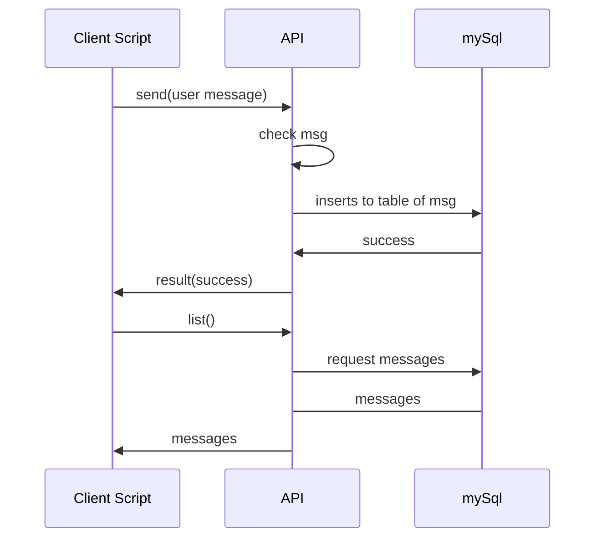

# Welcome to hwall
That project developed for SE308 lecturer **Raif Kaplan** in Izmir University of Economics Izmir/Turkey by **Can Bağdiken**, **Yiğit Demircan** and **Berkay Ömerbaş**. 

# Install
For project's test, you can install only clientside UI. Test API will be online until notes declared.

## Clientside UI
Only copy files and update the API URI in assets/js/script.js

## API

Copy all files to your server and create a mySql db. Update index.php with your mysql database access information and change your manage password. Its ready.

 
## How is it work?

System has two major part, client user interface script and API script. API developed with PHP(v5) and work with mySql, UI script developed by jquery (v2.2), html5 and css3.

